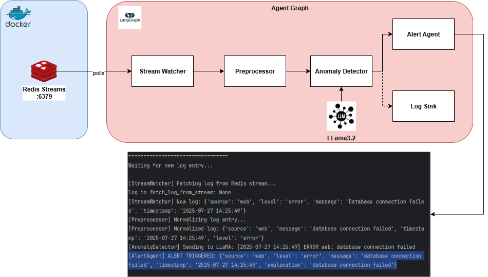
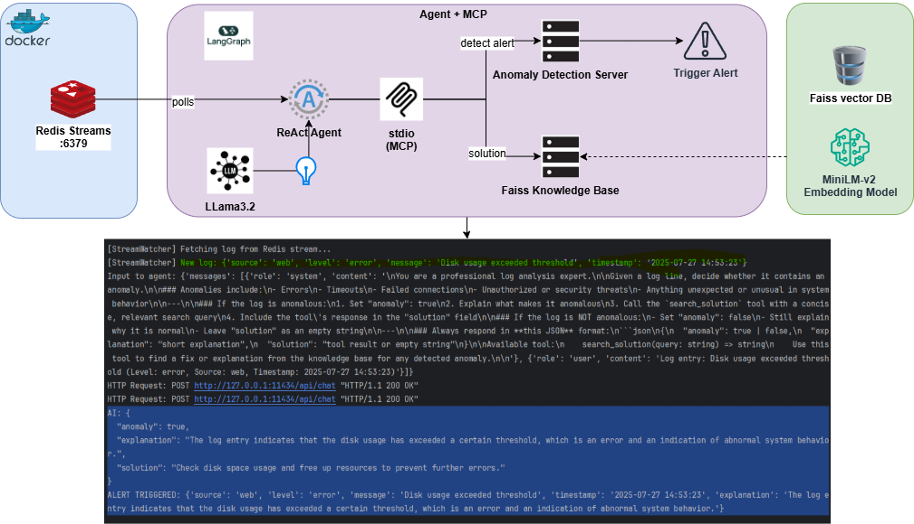

# Log Anomaly Detection

The log anomaly detection project is designed to identify unusual patterns in log data, which can indicate potential issues or security threats. This project utilizes LLM to analyze log files and detect anomalies.

## Description

Real-time Log Anomaly Detector with Redis Streams + LangGraph (Monitor logs pushed to Redis Stream and analyze in real-time via LangGraph)

## Getting Started

### Dependencies

- Python 3.10+
- Poetry 2.1.3
- Redis Streams
- Langchain
- Langgraph
- MCP
- LLama3.2
- SentenceTransformers
- FAISS CPU
- Docker

## Architecture

1. As a Langchain Graph Agent, it monitors Redis Streams for new log entries.
   

2. As a Langchain ReAct Agent, it communicates with MCP Servers and triggers alerts.
    

### Installing

Install add dependencies by running the command below:
```commandline
poetry install
```

Run Redis as a Docker container:
```commandline
docker run -d --name redis -p 6379:6379 redis:latest
```

### Executing program

* Install [MiniLM-v2](https://huggingface.co/sentence-transformers/all-MiniLM-L6-v2) Embedding Model in the project directory:
```
poetry run python app/knowledge_base/load_model.py
```

* Start the agent without MCP:
```commandline
poetry run python app/main.py
```

* Start the agent with MCP:
```commandline
poetry run python app/main_with_mcp.py
```

* Once, the servers are started and its polling Redis Streams with no logs, run the command below to push logs to Redis Streams:
```commandline
poetry run python tools/push_logs.py
```

* Viewing the logs in Redis Streams:

```commandline
# redis-cli
127.0.0.1:6379> XREAD STREAMS logs:incoming 0
```
  Response:
```commandline
452) 1) "1753604945428-0"
     2) 1) "source"
        2) "web"
        3) "level"
        4) "error"
        5) "message"
        6) "Unauthorized access attempt"
        7) "timestamp"
        8) "2025-07-27 13:59:05"
453) 1) "1753604946433-0"
     2) 1) "source"
        2) "web"
        3) "level"
        4) "error"
        5) "message"
        6) "Database connection failed"
        7) "timestamp"
        8) "2025-07-27 13:59:06"
```


## Authors

[Wriddhirup Dutta](https://www.linkedin.com/in/wriddhirup-dutta/)

## License

This project is licensed under the MIT License - see the LICENSE file for details

## Acknowledgments

* [Creating an MCP Server and Integrating with LangGraph](https://medium.com/@sajith_k/creating-an-mcp-server-and-integrating-with-langgraph-5f4fa434a4c7)